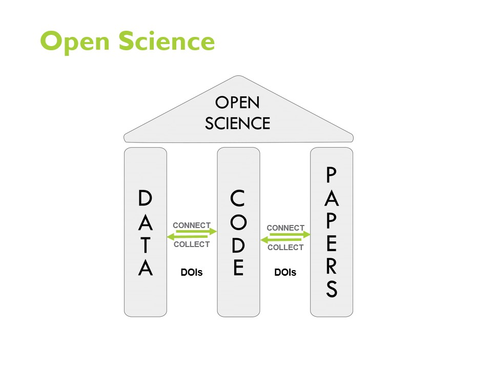

## Digital Object Identifier (DOI)

A Digital Object Identifier (DOI) is a persistent identifier and assigned to a digital resource, such as an article, dataset, software, or other scholarly work. The DOI provides a persistent link to the resource, making it easily identifiable and locatable on the internet. DOIs are commonly used in academic and scientific publishing to ensure the permanence and citability of research outputs. They serve as stable and permanent identifiers for digital content, enableing reliable linking, referencing and tracking of scholarly works.  

When accessing a digital object through a DOI link, the [DOI resolve system](https://www.doi.org/) redirects the accessor to the resource's current location. This capability ensures that even if the original location becomes inaccessible or changes, the users can still access the content using the DOI link. Each DOI is associated with metadata that provides essential information about the digital object, such as the authors, title, publication date, and publisher. This metadata also facilitates accurate and comprehensive citation and discovery of the content.  

The use of DOIs has become a standard practice in scholarly publishing and other digital content distribution platforms, promoting the permanence, reliability and accessibility of research outputs in publications and on the internet.  

  

_Modified image retrieved from [A Practical Guide for Immproving Transparency and Reproducibility in Neuroimaging Research](https://doi.org/10.1371/journal.pbio.1002506​)_  

Open Data, Open Source Software, and Open Publication Access form the foundational pillars of Open Science. DOIs play a crucial role in enabling seamless retrieval and utilization of openly available data by software, while research papers can effortlessly reference the software and data employed in the research process. This facilitates greater understanding, verification of results, and data reuse for novel analyses by other researchers.  

### DOI and Research Software

As discussed in the previous section, DOIs ensure the ciability of research outputs, which include research software. DOIs are crucial to the [three levels of reproducible research software](https://mcmasterrs.github.io/lm_reproducible-rs/smp/smp.html#reproducibility-goal), Research software for publication, Research software as a tool and Research software as infrastructure.  

In the context of research software for publication and research software as a tool, DOIs allow for the tracking of citations and usage metrics of the software. This provides valuable data on how the software is being used in the research community as well as its impact and reach, which can inform future development and demonstrate its value to funders and stakeholders.  

While in the context of research software as infrastrcture, DOIs not only enables the tracking of how and where the software is cited and used across different research publications and projects, it also acts as standardization and compilance. Many funding agencies, journals and institutions are increasingly requiring that research outputs, including software, be assigned DOIs. This helps to ensure compliance with the funding requirements as well as to promote best practices in research assets management.  

Moreover, a single research software often comes with multiple versions, each version may contain subtle change which may leads to drastically different outputs. DOIs provide another robust mechanism for indexing the different versions of software and facilitate proper citation of the research software in academic publication. Researchers can easily reference the specific version of the software they used and support their results by improving reproducibiltiy, as different versions of software might produce different results, while giving proper credit to the developers and maintaining the integrity.  

Since DOIs are widely recognized and integrated into academic databases, libraries and indexing services. This integration helps ensure that research software can be easily found and accessed by researchers across different platforms and disciplines. Some notable examples are [Zenodo](https://zenodo.org/) by CERN (European Organization for Nuclear Research) and the [Research Software Directory](https://research-software-directory.org/) by the Netherlands eScience Center.  
