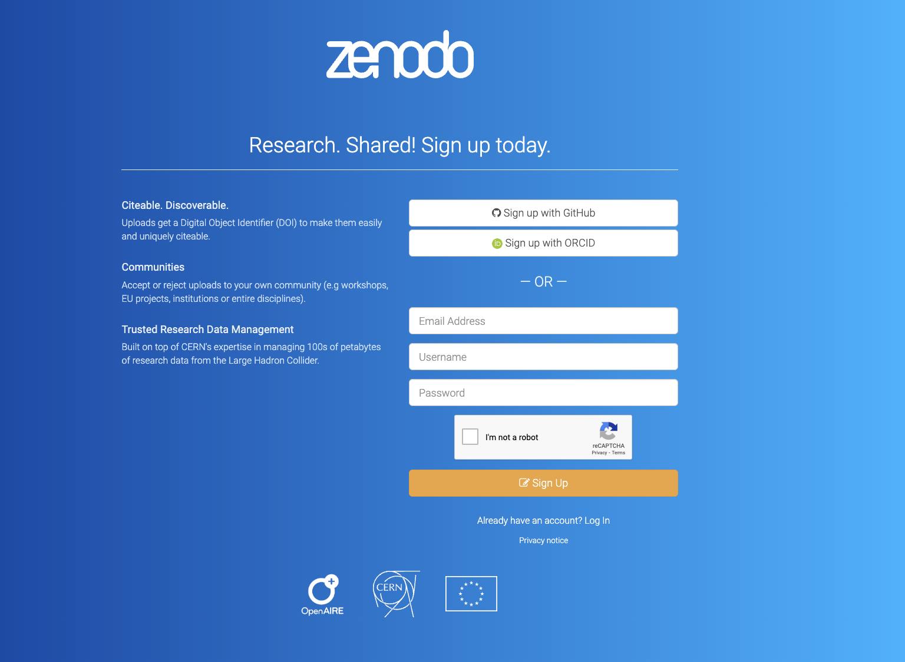
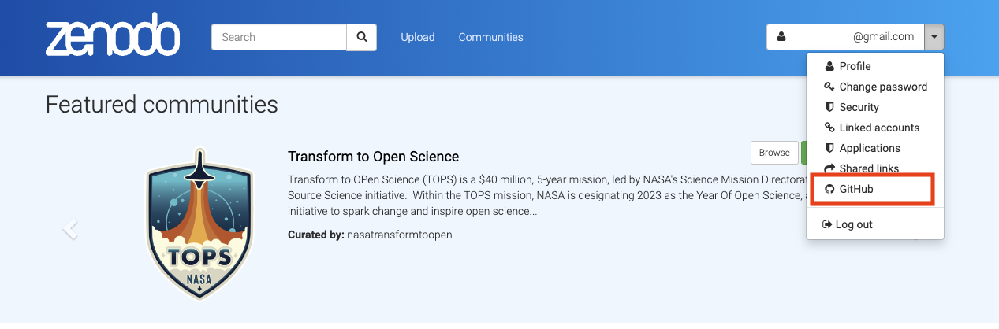
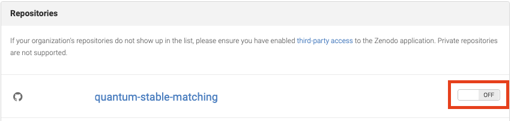
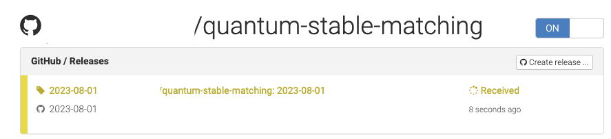
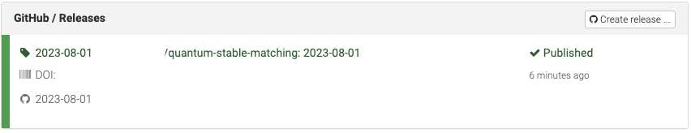
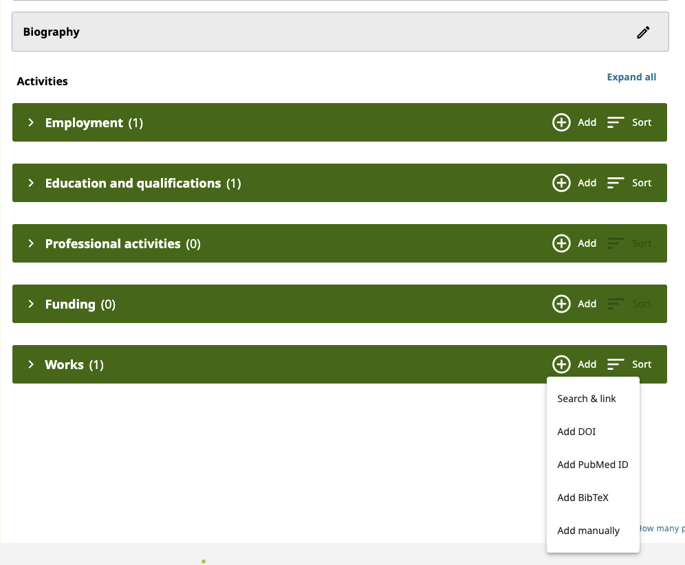
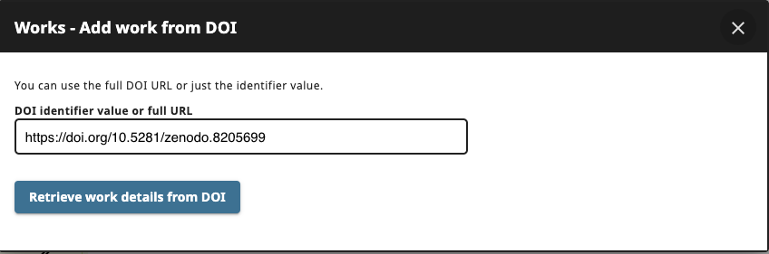
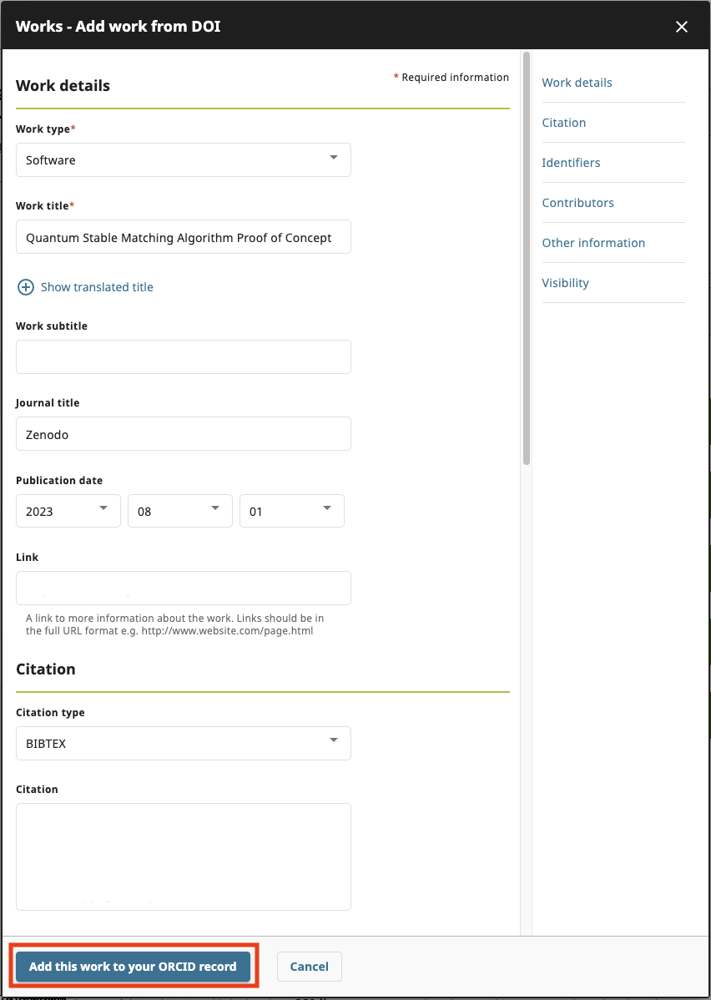
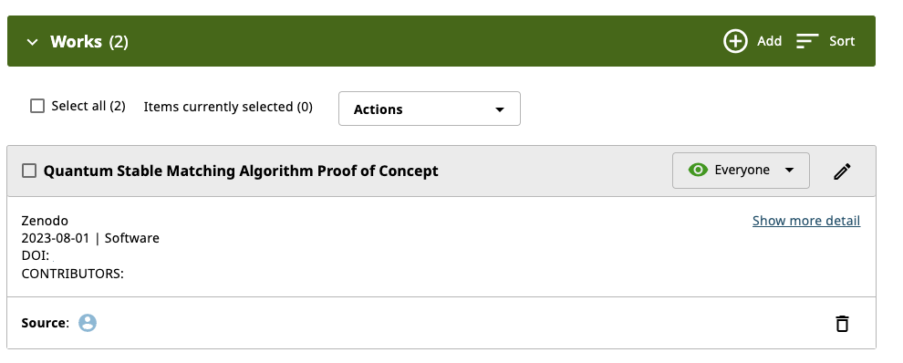

# Building Your Researcher Portfolio with PIDs

DOIs and ORCIDs work together to enhance the credibility, visibility, and attribution of scholarly research. DOIs provide unique identifiers for individual research outputs, while ORCIDs provide unique identifiers for researchers themselves. By linking the two, your scholarly works can be accurately attributed to you, facilitating better tracking of research impact and establishing reliable connections between researchers and their contributions. In the upcoming section we will explore the steps to connect your research software development with DOI and ORCID persistent identifiers to create a research profile.  

## Generate a DOI for Your Research Software

To generate a DOI for software, we will use the public and popular [Zenodo](https://about.zenodo.org/) repository. Zenodo is a free, open-access research data repository and publishing platform that facilitates the sharing, archiving and dissemination of research outputs. It is an initiative developed and operated by CERN (European Organization for Nuclear Research) and is part of the European OpenAIRE project.  

In this example, we will demonstrate how to create a repository on Zenodo directly from your _public_ repository on GitHub. (You cannot create a DOI to a private repository.) Per your Software Management Plan, this repository should include your software license as well as licenses for any software libraries included.

It is worth noting here, again, that cloud-based version control systems (e.g. GitHub, GitLab, BitBucket) are good for managing software versions and performing collaborative development, they are not considered persistent repositories for software. There are many reasons why a git repository might have its location or reference change. We use Zenodo in this example as such a persistent software repository, which is necessary for identifiers like DOIs to be persistent.

Furthermore, Zenodo is not the only persistent software repository that provides DOIs and integrates with cloud-based version control systems. For example. [figshare.com](https://figshare.com/) also meets these criteria. However, rather than attempting to document all possible scenarios, instead we demonstrate how to follow a common path for depositing software and inter-connecting PIDs such as ORCIDs and DOIs to start building a researcher profile today.

## Steps to Generate a DOI for Your Research Software

First, create a Zenodo account. You may use an email + password authentication method or single sign-on with GitHub or ORCID accounts.  

  

Once you have created and logged into your Zenodo account, click the drop-down menu (in the banner, top-right), which contains your Zenodo registration email, and select GitHub.  

  

Follow the instructions provided to link your GitHub account with Zenodo. Once you have linked your GitHub account with Zenodo, you will see all your public repositories from the Zenodo side. In Zenodo, scroll to the repository you want to index and toggle the switch box next to it to turn on automatic preservation. In the screenshots below we demonstrate these actions on the software repository `quantum-stable-matching`.

  

Then go to the GitHub repository and [create a release](https://docs.github.com/en/repositories/releasing-projects-on-github/managing-releases-in-a-repository). Zenodo will then automatically download the sources of the release and register a DOI. Everytime you create a release in GitHub, you will see the repository is marked as "Received" (in yellow) in Zenodo.  

> Zenodo will create a project-specific DOI and a version-specific DOI when indexing the first release. For subsequent releases, only version-specific DOIs will be created. You are encourage to share the project-specific DOIs to promote your software, as the project-specific DOIs will direct the users to the latest version of your project, and uses the version-specific DOIs in scenarios where reproducibility is desired.  

  

It will take approximately 1 hour for Zenodo to generate a DOI and about a day for the DOI to be effective on [doi.org](https://www.doi.org/) through their respective background automation processes.

## Adding Your Research Software to Your ORCID Record

Now that you have a DOI for your research software project, it is time to add it to your ORCID profile.  

If you do not yet have an ORCID record, [Register on ORCID](https://orcid.org/register) to create one.

Log in to your ORCID record. Go to "Works" and click the "Add" button. Select "Add DOI". Enter the DOI of your project and then click "Retrieve work details from DOI".  

  
  

Edit the work details and the click "Add this work to your ORCID record".  

  

You will see the new entry in the ORCID work record.  

  

At this point you have deposited a persistent copy of your software release on Zenodo, created a DOI for this software project and release, and linked this work with your personal persistent ORCID profile. You have started building your researcher portfolio. Future persistent identifiers that you create and associate with your ORCID will automaticaly be associated with your research profile going forward. 

## Start Today

There are is a low threshold, both in effort and qualifications, to create persistent identifiers for yourself and your software. Don't wait until the information or code is lost or at risk of being lost. It is much easier to persistently deposit and create reference identities (PIDs/DOIs) to software and other research objects at the time of creation and relevance, and out of habit, than after the fact and many at once. 

Start today!
