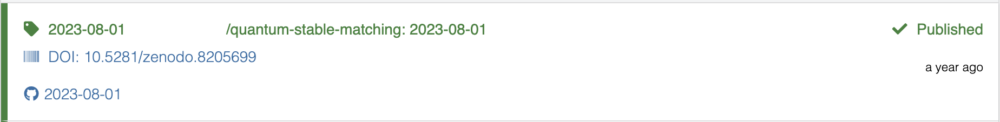

## Building Your Researcher Portfolio with ORCID ID

DOIs and ORCID IDs work together to enhance the credibility, visibility, and attribution of scholarly research. DOIs provide unique identifiers for individual research outputs, while ORCID IDs provide unique identifiers for researchers themselves. By linking the two, your scholarly works can be accurately attributed to you, facilitating better tracking of research impact and establishing reliable connections between researchers and their contributions. In the upcoming sections, we will explore the steps to connect your research software development with DOI and ORCID ID record.  

### Generate DOI for Your Research Software

Assuming you have deposited and publish your software source code on GitHub with a license. Now you can index your software source code with DOI using [Zenodo.org](https://zenodo.org/). Zenodo is a free and open-access research data repository and publishing platform that facilitates the sharing, archiving, and dissemination of research outputs. It is an initiative developed and operated by CERN (European Organization for Nuclear Research) and is part of the European OpenAIRE project.  

First, create a Zenodo account, you may use a email & password authentication method or Single-Sign On with GitHub or ORID ID.  

  

Once you have created a Zenodo account, click the dropdown menu which contains your Zenodo registration email and select GitHub.  

  

Follow the instructions provided to link your GitHub account with Zenodo. And once you have linked your GitHub account with Zenodo. You will see all your public repositories from Zenodo side. Scroll to the repository you want to index and toggle the switch box next to it to turn on automatic preservation.  

  

Then go to the GitHub repository and [create a release](https://docs.github.com/en/repositories/releasing-projects-on-github/managing-releases-in-a-repository). Zenodo will then automatically download the sources of the release and register a DOI. Once you have created a release, you will see the repository is marked as "Received" (in yellow) in Zenodo.  

  

It will take approximately 1 hour for Zenodo to generate a DOI and about a day for the DOI to be effective on [doi.org](https://www.doi.org/).  

### Adding Your Research Software to Your ORCID ID Record

Now that you have a DOI for your research software project, it is time to add it to your ORCID ID record.  

Login your ORCID ID record. Go to "Works" and click the "Add" button. Select "Add DOI". Enter the DOI of your project and then click "Retrieve work details from DOI".  

  
  

Edit the work details and the click "Add this work to your ORCID record".  

  

You will see the new entry in the ORCID ID work record.  

  
